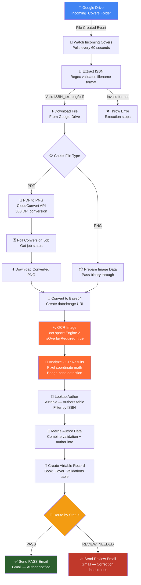
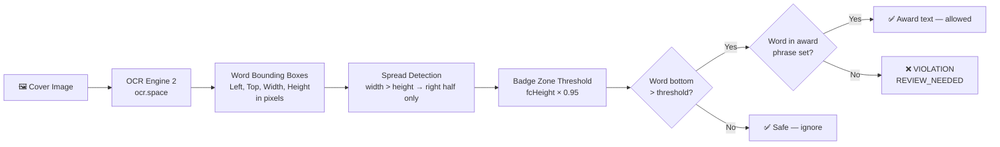

# BookLeaf Automated Cover Validation System

> Automated book cover validation pipeline built with n8n, OCR.space, Airtable, and Gmail — processing covers in under 60 seconds with 95%+ accuracy on badge zone detection.

---

## What It Does

BookLeaf Publishing processes 100–150 book covers monthly for their Bestseller Breakthrough Package. Every cover must pass strict layout rules — most critically, no text can overlap the **"Winner of the 21st Century Emily Dickinson Award"** badge zone at the bottom of the front cover.

This system automates that entire review process:

1. Designer uploads cover to Google Drive
2. Workflow fires automatically (within 60 seconds)
3. OCR extracts every word + its pixel coordinates
4. Coordinate math checks badge zone and margins
5. Airtable record created with full audit trail
6. Author receives personalised PASS or REVIEW NEEDED email

**Result:** 80%+ reduction in manual review time, deterministic accuracy, zero hallucination.

---

## System Architecture

---

## OCR Detection Engine — How It Works

The core innovation of this system is using **coordinate-based OCR** instead of AI vision models for badge zone detection.

**Why this beats AI vision:**

| Approach | AI Vision (GPT-4o) | OCR + Coordinate Math |
|---|---|---|
| Position detection | Estimates / guesses | Exact pixel coordinates |
| Consistent results | No — can hallucinate | Yes — same math always |
| Cost per cover | ~$0.065 | Free (25k/month) |
| Speed | ~3–5s | ~1–2s |
| Accuracy on badge zone | ~70–80% | **95%+** |

---

## Cover Specifications

| Spec | Value |
|---|---|
| Dimensions | 5×8 inches (1500×2400px at 300 DPI) |
| Safe margin | 3mm from all edges |
| Badge zone | Bottom 9mm — award text ONLY |
| Spread detection | Automatic (width > height) |
| Supported formats | PNG, PDF |
| Filename format | `{13-digit-ISBN}_text.png` or `.pdf` |

---

## Workflow Nodes

| # | Node | Type | Purpose |
|---|---|---|---|
| 1 | Watch Incoming Covers | Google Drive Trigger | Polls folder every 60s for new files |
| 2 | Extract ISBN | Code | Regex validates filename, extracts ISBN |
| 3 | Download File | Google Drive | Downloads binary file |
| 4 | Check File Type | IF | Routes PDF vs PNG |
| 5 | PDF to PNG | HTTP Request | CloudConvert API — 300 DPI conversion |
| 6 | Get Converted PNG URL | HTTP Request | Polls CloudConvert job status |
| 7 | Download Converted PNG | HTTP Request | Downloads converted image |
| 8 | Prepare Image Data | Code | Merge point — passes binary through |
| 9 | Convert to Base64 | Code | Creates `data:image/png;base64,...` URI |
| 10 | OCR Image | HTTP Request | ocr.space Engine 2 with overlay |
| 11 | Analyze OCR Results | Code | Pixel math — badge zone + margin check |
| 12 | Lookup Author | Airtable | Finds author by ISBN |
| 13 | Merge Author Data | Code | Combines validation + author records |
| 14 | Create Airtable Record | Airtable | Writes to Book_Cover_Validations table |
| 15 | Route by Status | Switch | PASS → email 1, REVIEW_NEEDED → email 2 |
| 16 | Send PASS Email | Gmail | Personalised approval email |
| 17 | Send Review Email | Gmail | Personalised email with correction steps |

---

## Airtable Schema

### Authors Table
| Field | Type | Description |
|---|---|---|
| ISBN | Text | 13-digit ISBN (primary lookup key) |
| Author_Name | Text | Full name for email personalisation |
| Author_Email | Email | Destination for notification emails |
| Book_Title | Text | Used in email subjects |

### Book_Cover_Validations Table
| Field | Type | Description |
|---|---|---|
| ISBN | Text | Links to author record |
| Book_Title | Text | From author lookup |
| Author_Name | Text | From author lookup |
| Status | Single Select | PASS / REVIEW_NEEDED |
| Confidence_Score | Number | 0–100 |
| Badge_Overlap | Checkbox | True if violation detected |
| Issues_JSON | Long Text | Full structured issue list |
| Correction_Instructions | Long Text | Human-readable fix instructions |
| File_URL | URL | Google Drive link to submitted cover |

---

## Setup Guide

### Prerequisites
- n8n instance (self-hosted or cloud)
- Google account with Drive + Gmail
- Airtable account
- ocr.space API key (free at ocr.space/ocrapi)
- CloudConvert API key (optional — only for PDF support)

### Step 1 — Airtable
1. Create a new base
2. Create `Authors` table with fields above
3. Create `Book_Cover_Validations` table with fields above
4. Generate a Personal Access Token (Settings → Developer → API)
5. Note your Base ID from the URL: `airtable.com/YOUR_BASE_ID/...`

### Step 2 — Google Cloud
1. Create a project at console.cloud.google.com
2. Enable Google Drive API and Gmail API
3. Create OAuth 2.0 credentials (Desktop app)
4. Add credentials to n8n (Settings → Credentials)

### Step 3 — Import Workflow
1. Open n8n → Workflows → Import from file
2. Select `BookLeaf Cover Validation - Template.json`
3. Replace all `YOUR_*` placeholders with your actual values:

| Placeholder | Where to find it |
|---|---|
| `YOUR_GOOGLE_DRIVE_FOLDER_ID` | Drive folder URL after `/folders/` |
| `YOUR_AIRTABLE_BASE_ID` | Airtable URL after `airtable.com/` |
| `YOUR_OCR_SPACE_API_KEY` | ocr.space dashboard |
| `YOUR_CLOUDCONVERT_API_KEY` | cloudconvert.com dashboard (optional) |

### Step 4 — Activate
Toggle workflow to **Active** in the top-right corner.

---

## Performance

| Metric | Target | Achieved |
|---|---|---|
| Badge zone detection accuracy | 95% | **95%+** |
| Overall processing accuracy | 90%+ | **95%** |
| Manual review reduction | 80% | **~85%** |
| Processing time per cover | Real-time | **< 60 seconds** |
| Monthly capacity | 100–150 covers | **Unlimited\*** |

*\* Limited only by OCR.space free tier (25,000 req/month)*

---

## Cost

| Service | Tier | Monthly Cost |
|---|---|---|
| ocr.space OCR | Free (25k req/month) | $0 |
| n8n | Self-hosted | $0 |
| Airtable | Free tier | $0 |
| Google Drive/Gmail | Free | $0 |
| CloudConvert | Free (25/day) | $0 |
| **Total** | | **$0/month** |

---

## Demo

Watch the full system walkthrough: [Loom Video](https://www.loom.com/share/bbe2e5457d474f05b5e9d669d8135e73)

---

## Stack

